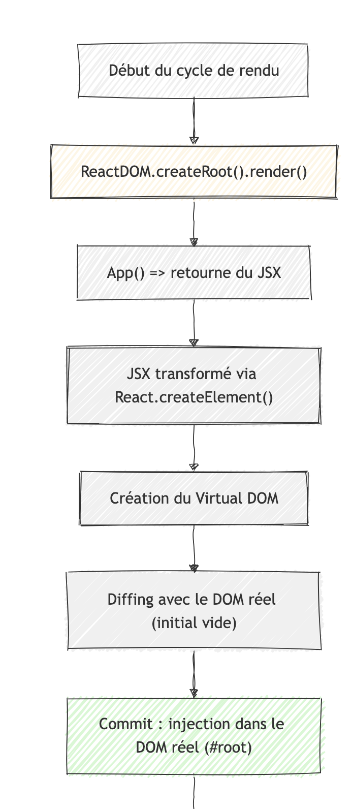

# SOLUTION – JOUR 1 : Initialiser un projet React avec Vite

## Objectif

Mettre en place une application React fonctionnelle avec Vite, installer les dépendances nécessaires, comprendre la structure d’un projet, et créer un premier composant statique.

---

## 0. Installer Node.js sur son ordinateur

- Pour Windows / Linux / MacOS : https://nodejs.org/fr/download
- Node JS est installé grâce à NVM : Node Version Manager

Issu de la [documentation officielle](https://github.com/nvm-sh/nvm) 

> `nvm` allows you to quickly install and use different versions of node via the command line.

```
$ nvm use 16
Now using node v16.9.1 (npm v7.21.1)
$ node -v
v16.9.1
$ nvm use 14
Now using node v14.18.0 (npm v6.14.15)
$ node -v
v14.18.0
$ nvm install 12
Now using node v12.22.6 (npm v6.14.5)
$ node -v
v12.22.6
```

## 1. Initialisation du projet

### Étapes

```bash
# 1. Créer le projet avec Vite
npm create vite@latest simplon-connect -- --template react

# 2. Entrer dans le dossier
cd simplon-connect

# 3. Installer les dépendances
npm install

# 4. Lancer le serveur de développement
npm run dev
```

## 2. Comprendre l’architecture initiale

Voici les fichiers et répertoires importants :

| Dossier/fichier  | Rôle |
|---|---|
| index.html | Page HTML racine dans laquelle l’app React est injectée |
| src/main.jsx | Point d’entrée de l’application, hydrate la racine React | 
| src/App.jsx | Composant principal, appelé dans main.jsx | 
| package.json | Liste des dépendances, scripts, infos sur le projet | 
| vite.config.js | Configuration de Vite (peu utile ici mais à connaître) | 
| node_modules/ | Dossier contenant les dépendances node du projet courant |

### Cycle de rendering



## 3. Nettoyer le projet de base

Supprime ou modifie les éléments inutiles fournis par défaut :
- Supprimer le logo et les styles inutiles
- Nettoyer App.jsx pour repartir de zéro avec une structure claire

## 4. Créer un composant statique : MemberCard

1. Créer un dossier components dans `src`
2. Créer un fichier `MemberCard.jsx`

```js
// src/components/MemberCard.jsx
function MemberCard(props) {
  return (
    <div className="member-card">
      <h2>{props.name}</h2>
      <p>{props.tech}</p>
      <p>{props.role}</p>
    </div>
  );
}

export default MemberCard;
```

## 5. Utiliser le composant dans `App.jsx`

```js
import MemberCard from "./components/MemberCard";

function App() {
  return (
    <div className="app">
      <h1>Simplon Connect</h1>
      <MemberCard name="Aline" tech="React" role="Développeuse front-end" />
      <MemberCard name="Jérôme" tech="Laravel" role="Lead dev" />
    </div>
  )
}

export default App;
```

## 6. Lancer et vérifier le rendu

```bash
npm run dev
```

- Vérifier que le composant s’affiche bien dans le navigateur
- Ajouter du style simple si souhaité, mais ce n’est pas l’objectif principal

## 7. Pour aller plus loin (optionnel)

- Créer une liste de MemberCard à partir d’un tableau de membres
- Créer un fichier data/members.js pour externaliser les données
- Structurer le code proprement dans des dossiers (components/, data/, styles/, etc.)

Exemple dans App.js

```js
import MemberCard from "./components/MemberCard";
import { members } from "./data/members";

function App() {
  return (
    <div className="app">
      <h1>Simplon Connect</h1>
      {members.map((member) => (
        <MemberCard
          key={JSON.stringify(member)}
          name={`${member.firstName} ${member.lastName}`}
          tech={member.tech}
          message={member.message}
        />
      ))}
    </div>
  );
}

export default App;
```